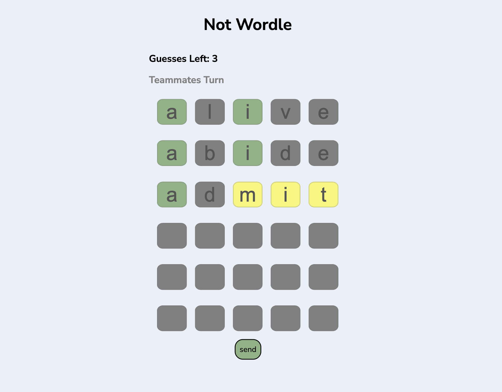

# Not Wordle

## Overview

Not Wordle is a real-time, collaborative word guessing game inspired by the popular NYT Wordle. Built as a web application using Node.js and Vue.js with WebSocket communication, it allows two players to work together to guess a five-letter word within six shared attempts. Players take turns making guesses, with feedback on letter correctness and placement displayed in real-time on both players' screens. The game concludes with a win screen when the word is guessed or a loss screen when all six attempts are exhausted.

## Features

* **Real-time Multiplayer:** Requires two players to connect to the same game session to start playing.
* **Shared Guesses:** Both players contribute to a common pool of six guesses.
* **Turn Based Gameplay:** Players alternate turns to input their five-letter word guesses.
* **Real-time Feedback:** After each guess, both players instantly see color-coded feedback indicating:
    * **Green:** Correct letter in the correct position.
    * **Yellow:** Correct letter in the wrong position.
    * **Gray:** Incorrect letter.
* **Guess History:** All previous guesses made by both players are displayed on both screens.
* **Win Condition:** The game ends and a win screen is shown to both players when the target word is correctly guessed.
* **Lose Condition:** The game ends and a loss screen is shown to both players when all six shared guesses are used without guessing the correct word.

## Technical Details

* **Frontend:** Developed with **Vue.js** and utilizes the **native JavaScript WebSocket API** for bidirectional communication with the server. The user interface dynamically updates in real-time based on WebSocket events.
* **Backend:** Built using **Node.js** and the **`ws` (Node.js WebSocket Library)**. The server manages game state, handles player connections, validates guesses, determines feedback, and broadcasts updates to both connected clients in a game session.
* **Real-time Communication:** WebSocket protocol is used for instant, two way communication between the server and the connected players, enabling the real-time collaborative gameplay experience.

## Key Functionalities

* **Player Pairing:** The application requires two players to connect to initiate a game. A Websocket client pool is used to pair players two at a time.
* **Guess Submission:** Players can input five letter word guesses through an interactive interface.
* **Guess Evaluation:** The server receives a guess, validates its length, and compares it against the secret word to generate feedback.
* **State Management:** The server maintains the current game state, including the number of remaining guesses, the history of guesses, and the target word.
* **Real-time Updates:** The server broadcasts the submitted guess and the evaluation feedback to both connected players in real-time.
* **Win/Loss Condition Handling:** The server detects when the game has been won or lost and notifies both clients to display the appropriate screen.

## Visuals
* **Player One's Turn**  
  

* **Player Two Screen**  
  

* **Win Screen**  
  

* **Lose Screen**  
  